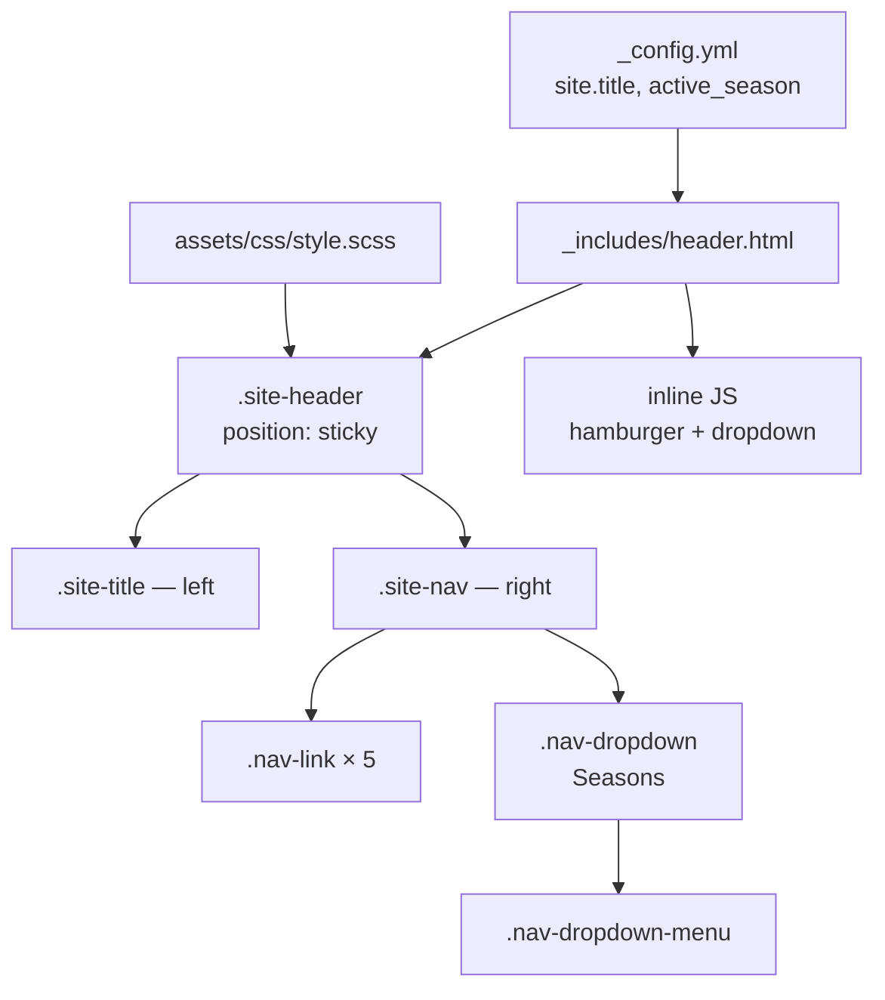

# Design Document: Horizontal Navigation Bar

## Overview

This design replaces the Minima theme's default vertical navigation with a full-width sticky horizontal nav bar. The implementation is entirely within the existing Jekyll/Liquid/SCSS stack — no new build tools or JavaScript frameworks are introduced.

The existing `_includes/header.html` already contains a working implementation of the horizontal nav structure (flex layout, hamburger toggle, seasons dropdown, active-link Liquid logic). The design formalizes what's already in place, identifies gaps against the requirements, and specifies the complete target state.

Key design decisions:
- **No JavaScript framework** — vanilla JS event listeners, consistent with the existing inline script in `header.html`.
- **CSS-only sticky** — `position: sticky` preferred over `position: fixed` to avoid the body-padding compensation problem; fall back to `fixed` + explicit `padding-top` if sticky has cross-browser issues on GitHub Pages.
- **SCSS variables** — all colors reference the existing design tokens in `assets/css/style.scss`; no new color literals.
- **Single stylesheet** — all nav styles live in `assets/css/style.scss`, not in `assets/main.scss` or inline.

---

## Architecture

The feature touches three files:

```
_includes/header.html      ← HTML structure + inline JS
assets/css/style.scss      ← All nav SCSS rules
_layouts/default.html      ← Body padding-top for sticky offset (if needed)
```

No new files are created. The Minima theme's `_layouts/default.html` may need to be copied into the project's `_layouts/` directory if it doesn't already exist, so the body padding override can be applied without modifying the gem source.



---

## Components and Interfaces

### `_includes/header.html`

Renders the full `<header>` element. Liquid variables consumed:

| Variable | Source | Usage |
|---|---|---|
| `site.title` | `_config.yml` | Site title anchor text |
| `site.active_season` | `_config.yml` | Active season link href |
| `page.url` | Jekyll page object | Active-link class logic |

HTML structure:

```
<header class="site-header">
  <div class="wrapper">
    <a class="site-title" href="/">…</a>
    <button class="nav-toggle" aria-label="Toggle navigation" aria-expanded="false">
      <span class="hamburger-bar"></span> × 3
    </button>
    <nav class="site-nav" id="site-nav">
      <a class="nav-link [active]" href="/">Home</a>
      <a class="nav-link [active]" href="/teams">Teams</a>
      <div class="nav-dropdown [active]">
        <button class="nav-dropdown-toggle" aria-haspopup="true" aria-expanded="false">
          Seasons ▾
        </button>
        <ul class="nav-dropdown-menu">
          <li><a href="/seasons/{active_season}">Active Season</a></li>
          <li><a href="/seasons">All Seasons</a></li>
        </ul>
      </div>
      <a class="nav-link [active]" href="/events">Events</a>
      <a class="nav-link [active]" href="/blog">Blog</a>
      <a class="nav-link [active]" href="/submit-match">Submit Match</a>
    </nav>
  </div>
</header>
```

Inline `<script>` block handles:
1. Hamburger toggle — clicks toggle `.nav-open` on `#site-nav` and sync `aria-expanded`.
2. Dropdown toggle — clicks toggle `.open` on `.nav-dropdown-menu` and sync `aria-expanded`.
3. Outside-click listener — removes `.open` and resets `aria-expanded` when click target is outside the dropdown.
4. Keyboard support — `Escape` key closes the open dropdown.

### `assets/css/style.scss` — Nav Rules

Key rules and their requirements mapping:

| Rule | Requirement |
|---|---|
| `.site-header { position: sticky; top: 0; z-index: 1000; min-height: 56px; }` | 1.1, 1.2, 1.3 |
| `.site-header .wrapper { display: flex; justify-content: space-between; align-items: center; }` | 2.1 |
| `.site-nav { display: flex; flex-wrap: nowrap; gap: 8px; align-items: center; }` | 2.2 |
| `.nav-link.active, .nav-dropdown.active .nav-dropdown-toggle { color: $accent; text-decoration: underline; }` | 3.1, 3.2, 4.4 |
| `.nav-dropdown-menu { position: absolute; display: none; } .nav-dropdown-menu.open { display: block; }` | 4.1, 4.2 |
| `@media (max-width: 768px) { .nav-toggle { display: flex; } .site-nav { display: none; } .site-nav.nav-open { display: flex; flex-direction: column; } }` | 5.1, 5.2, 5.5 |
| `.site-header { background: $bg-secondary; border-bottom: 1px solid $border; }` | 6.1, 6.2 |
| `.nav-link { color: $text-secondary; } .nav-link:hover { color: $text-primary; }` | 6.3, 6.4 |

---

## Data Models

No new data models. The nav is driven by:

- **Static link list** — hardcoded in `header.html` (Home, Teams, Seasons, Events, Blog, Submit Match). Adding a new top-level page requires editing `header.html`.
- **`site.active_season`** — string from `_config.yml`, used to construct the active season URL.
- **`page.url`** — Jekyll string, used in Liquid conditionals to apply the `.active` class.

If the nav link list needs to be data-driven in the future, it could be moved to `_data/nav.yml` and iterated with Liquid, but that is out of scope for this feature.

---

## Correctness Properties

*A property is a characteristic or behavior that should hold true across all valid executions of a system — essentially, a formal statement about what the system should do. Properties serve as the bridge between human-readable specifications and machine-verifiable correctness guarantees.*

This feature is primarily HTML/CSS/Liquid rendering. PBT applies narrowly: the Liquid template logic (active-link class application) and the JavaScript state management (aria-expanded sync) have universal properties worth specifying. CSS layout rules are verified by smoke/example tests.

### Property 1: Active link class matches current page URL

*For any* page URL that corresponds to a nav link's href, the rendered header HTML should contain exactly one nav item with the `active` class, and it should be the item whose href matches the current page URL.

**Validates: Requirements 3.1, 3.2**

### Property 2: Dropdown active state matches URL prefix

*For any* page URL that contains `/seasons`, the `.nav-dropdown` element should have the `active` class applied to it; for any page URL that does not contain `/seasons`, the `.nav-dropdown` element should not have the `active` class.

**Validates: Requirements 4.4**

### Property 3: aria-expanded mirrors nav visibility

*For any* sequence of hamburger button clicks, the `aria-expanded` attribute on the hamburger button should always equal `"true"` when the nav has the `nav-open` class, and `"false"` when it does not.

**Validates: Requirements 5.3, 5.4**

---

## Error Handling

| Scenario | Handling |
|---|---|
| `site.active_season` not set in `_config.yml` | The active season link href becomes `/seasons/` — still a valid URL (redirects to all-seasons). No crash. |
| `page.url` is nil or unexpected format | Liquid `contains` and `==` comparisons return false-y — no active class applied. Nav renders without active state. |
| JS disabled | Hamburger button and dropdown toggle are non-functional. On mobile, nav links are hidden with no way to show them. Acceptable degradation for a club site; could be mitigated with a `<noscript>` CSS rule if needed. |
| Dropdown open + page navigation | Browser navigation destroys the page; dropdown state is not persisted. Expected behavior. |

---

## Testing Strategy

This feature is HTML/CSS/Liquid rendering with a small vanilla JS layer. Property-based testing applies to the Liquid template logic and JS state management. CSS rules are verified by smoke and example tests.

### Unit / Example Tests

Verify specific structural and behavioral requirements:

- Header HTML contains all 6 nav links with correct hrefs (Req 2.3)
- Site title anchor has `href="/"` (Req 2.4)
- Clicking hamburger toggles `nav-open` class on `#site-nav` (Req 5.2)
- Clicking dropdown toggle adds `open` class to `.nav-dropdown-menu` (Req 4.2)
- Clicking outside the dropdown removes `open` class (Req 4.3)
- `header.html` contains no inline `style` attributes (Req 6.5)
- Dropdown menu contains links to `/seasons/{active_season}` and `/seasons` (Req 4.1)

### Property-Based Tests

Using a property-based testing library (e.g., `fast-check` for JavaScript, since the project already has a Node/Jest test setup):

- **Property 1** — Generate a set of page URLs (one per nav link), render the header Liquid template for each, assert exactly one `.active` element whose href matches the URL. Minimum 100 iterations.
  - Tag: `Feature: horizontal-nav, Property 1: active link class matches current page URL`
- **Property 2** — Generate page URLs with and without `/seasons` prefix, render header, assert `.nav-dropdown.active` presence matches URL prefix. Minimum 100 iterations.
  - Tag: `Feature: horizontal-nav, Property 2: dropdown active state matches URL prefix`
- **Property 3** — Generate random sequences of hamburger click events, simulate them against the JS toggle logic, assert `aria-expanded` always equals the string representation of the `nav-open` class presence. Minimum 100 iterations.
  - Tag: `Feature: horizontal-nav, Property 3: aria-expanded mirrors nav visibility`

### Smoke Tests (CSS/Structure)

Single-pass checks that don't benefit from iteration:

- `assets/css/style.scss` contains `position: sticky` (or `fixed`) for `.site-header` (Req 1.2)
- `assets/css/style.scss` contains `min-height: 56px` for `.site-header` (Req 1.3)
- `assets/css/style.scss` contains `flex-wrap: nowrap` for `.site-nav` at desktop (Req 2.2)
- `assets/css/style.scss` contains `background: $bg-secondary` / `#1a1a2e` for `.site-header` (Req 6.1)
- `assets/css/style.scss` contains `border-bottom` with `$border` / `#2a2a4a` (Req 6.2)
- `assets/css/style.scss` contains `color: $text-secondary` for `.nav-link` default state (Req 6.3)
- `assets/css/style.scss` contains `color: $text-primary` for `.nav-link:hover` (Req 6.4)
- `assets/css/style.scss` contains `color: $accent` and `text-decoration: underline` for `.active` (Req 3.2)
- `_includes/header.html` contains `aria-haspopup` and `aria-expanded` on dropdown toggle (Req 4.5)
- Media query at `max-width: 768px` hides `.site-nav` and shows `.nav-toggle` (Req 5.1, 5.5)
