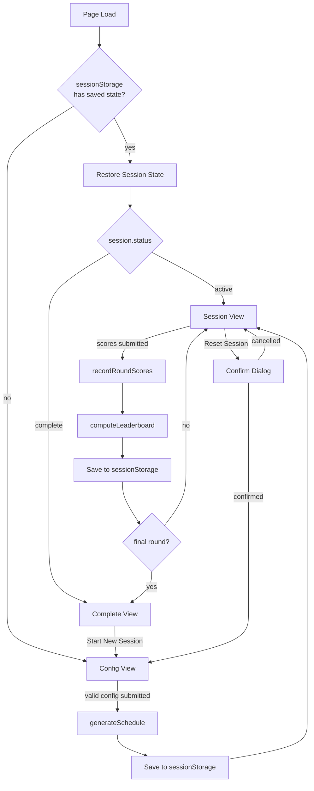

# Design Document: Round-Robin Session Manager

## Overview

The Round-Robin Session Manager is a fully client-side interactive page added to the Junebug Pickleball League Jekyll site. It lives at `/session-manager/` and is implemented as a single HTML page (`pages/session-manager.html`) with an accompanying JavaScript module (`assets/js/session-manager.js`).

Because the site is a static Jekyll site hosted on GitHub Pages, all logic — schedule generation, score tracking, leaderboard computation, and state persistence — runs entirely in the browser. Jekyll/Liquid renders only the static page shell at build time. `sessionStorage` is used for persistence across page refreshes.

The page operates as a single-page application (SPA) with three distinct views managed by a lightweight client-side state machine:

1. **Config view** — organizer enters player count, court count, round count, format, and player names
2. **Session view** — displays current round's court assignments, score submission form, and live leaderboard
3. **Complete view** — displays final leaderboard, session summary, and a "Start New Session" button

---

## Architecture

The feature is split into two layers:

- **Pure logic module** (`assets/js/session-manager.js`) — exported pure functions for schedule generation, validation, leaderboard computation, and state serialization. These are importable and fully testable without a DOM.
- **Page controller** (inline `<script>` in `pages/session-manager.html`) — wires DOM events to the logic module, manages view transitions, and reads/writes `sessionStorage`.

This mirrors the existing pattern in the codebase (`assets/js/match-utils.js` + inline page scripts).



---

## Components and Interfaces

### `session-manager.js` — Exported Pure Functions

```js
/**
 * Validates a session configuration object.
 * @param {{ playerCount, courtCount, roundCount, format }} config
 * @returns {{ valid: boolean, errors: { field: string, message: string }[] }}
 */
export function validateConfig(config)

/**
 * Resolves player names, substituting "Player N" for any empty slot.
 * @param {string[]} names  - raw name inputs (may be empty strings)
 * @returns {string[]}      - resolved names, same length
 */
export function resolvePlayerNames(names)

/**
 * Generates a full round-robin schedule using the circle method.
 * @param {{ playerCount, courtCount, roundCount, format }} config
 * @param {string[]} playerNames
 * @returns {Round[]}
 */
export function generateSchedule(config, playerNames)

/**
 * Validates a set of score inputs for a round.
 * @param {ScoreInput[]} scores  - array of { matchId, p1Score, p2Score }
 * @returns {{ valid: boolean, errors: { matchId: string, field: string, message: string }[] }}
 */
export function validateScores(scores)

/**
 * Records scores for the current round and returns updated session state.
 * @param {SessionState} state
 * @param {ScoreInput[]} scores
 * @returns {SessionState}
 */
export function recordRoundScores(state, scores)

/**
 * Computes the leaderboard from session state.
 * @param {SessionState} state
 * @returns {LeaderboardEntry[]}  - sorted by wins desc, then pointDiff desc, then pointsScored desc
 */
export function computeLeaderboard(state)

/**
 * Serializes session state to a JSON string for sessionStorage.
 * @param {SessionState} state
 * @returns {string}
 */
export function serializeState(state)

/**
 * Deserializes session state from a JSON string.
 * @param {string} json
 * @returns {SessionState}
 */
export function deserializeState(json)
```

### Page Controller (inline script)

Responsibilities:
- Reads/writes `sessionStorage` under the key `jpl_session_manager`
- Manages view visibility (show/hide config, session, complete sections)
- Wires form submit events to logic functions
- Renders current round cards, score form, and leaderboard table
- Handles Reset Session confirmation dialog

---

## Data Models

### `SessionConfig`

```js
{
  playerCount: number,   // 2–32
  courtCount:  number,   // 1–16
  roundCount:  number,   // 1–64
  format:      'single' | 'double'
}
```

### `Match`

```js
{
  matchId:  string,   // e.g. "r1-c2" (round 1, court 2)
  courtNum: number,   // 1–N
  p1:       string,   // player name
  p2:       string,   // player name
  p1Score:  number | null,
  p2Score:  number | null
}
```

### `Round`

```js
{
  roundNum: number,
  matches:  Match[],
  byes:     string[]  // player names sitting out
}
```

### `SessionState`

```js
{
  config:       SessionConfig,
  players:      string[],
  schedule:     Round[],
  currentRound: number,   // 1-based index
  status:       'active' | 'complete'
}
```

### `LeaderboardEntry`

```js
{
  rank:        number,
  name:        string,
  wins:        number,
  losses:      number,
  pointDiff:   number,   // points scored - points conceded
  pointsScored: number
}
```

### `ScoreInput`

```js
{
  matchId: string,
  p1Score: string,  // raw string from input field
  p2Score: string
}
```

---

## Correctness Properties

*A property is a characteristic or behavior that should hold true across all valid executions of a system — essentially, a formal statement about what the system should do. Properties serve as the bridge between human-readable specifications and machine-verifiable correctness guarantees.*

### Property 1: Config validation accepts exactly the valid range

*For any* integer value for playerCount, courtCount, or roundCount, `validateConfig` SHALL return valid if and only if the value falls within its allowed range (playerCount ∈ [2,32], courtCount ∈ [1,16], roundCount ∈ [1,64]).

**Validates: Requirements 1.2, 1.3, 1.4**

### Property 2: Player name resolution substitutes empty slots

*For any* array of player name strings where some entries are empty or whitespace-only, `resolvePlayerNames` SHALL return an array of the same length where every previously-empty slot is replaced with "Player N" (1-based index) and non-empty slots are preserved unchanged.

**Validates: Requirements 1.8**

### Property 3: Schedule has exactly the configured number of rounds

*For any* valid session configuration, `generateSchedule` SHALL return a schedule array whose length equals `config.roundCount`.

**Validates: Requirements 2.1**

### Property 4: Round-robin pair frequency invariant

*For any* valid player count and format, `generateSchedule` SHALL produce a schedule where every distinct pair of players appears as opponents exactly once (single round-robin) or exactly twice (double round-robin) across all rounds.

**Validates: Requirements 2.2, 2.3**

### Property 5: Bye distribution fairness for odd player counts

*For any* odd player count, `generateSchedule` SHALL produce a schedule where each round has exactly one bye, and the maximum difference in bye count between any two players across all rounds is at most 1.

**Validates: Requirements 2.4**

### Property 6: Court count invariant

*For any* valid configuration, `generateSchedule` SHALL produce a schedule where no round contains more matches than `config.courtCount`, and all court numbers in the schedule are in the range [1, courtCount].

**Validates: Requirements 2.5, 2.7**

### Property 7: Score validation accepts non-negative integers only

*For any* score input value, `validateScores` SHALL accept it if and only if it is a non-negative integer (i.e., a string representation of a whole number ≥ 0), and reject negative values and non-numeric strings.

**Validates: Requirements 4.2**

### Property 8: Score re-submission overwrites previous scores

*For any* session state and two distinct sets of valid scores for the same round, calling `recordRoundScores` twice SHALL result in the session state reflecting only the second set of scores.

**Validates: Requirements 4.7**

### Property 9: Round advancement on non-final score submission

*For any* session state where `currentRound < schedule.length`, calling `recordRoundScores` with valid scores SHALL return a state where `currentRound` is incremented by exactly 1.

**Validates: Requirements 4.5**

### Property 10: Leaderboard sort order invariant

*For any* session state, `computeLeaderboard` SHALL return entries sorted such that for any adjacent pair (a, b): a.wins > b.wins, OR (a.wins === b.wins AND a.pointDiff > b.pointDiff), OR (a.wins === b.wins AND a.pointDiff === b.pointDiff AND a.pointsScored >= b.pointsScored).

**Validates: Requirements 5.1, 5.2, 5.3**

### Property 11: Session state serialization round-trip

*For any* valid `SessionState` object, `deserializeState(serializeState(state))` SHALL produce a value deeply equal to the original state.

**Validates: Requirements 6.1, 6.2**

### Property 12: Session summary accuracy

*For any* completed session, the summary SHALL report total rounds equal to `schedule.length` and total matches equal to the sum of `matches.length` across all rounds.

**Validates: Requirements 7.4**

---

## Error Handling

### Config Validation Errors
- `validateConfig` returns a structured errors array with `field` and `message` per violation.
- The page controller renders each error inline next to its field and does not proceed to schedule generation.

### Score Validation Errors
- `validateScores` returns per-match, per-field errors.
- The page controller renders errors inline next to the offending input and does not advance the round.

### sessionStorage Errors
- If `sessionStorage` is unavailable (e.g. private browsing with storage blocked), the page degrades gracefully: the session runs in memory only, and a non-blocking warning is shown.
- If `deserializeState` throws (corrupted data), the page clears the key and falls back to the config view.

### Reset Confirmation
- The "Reset Session" button triggers a `window.confirm` dialog. If the user cancels, no state change occurs.

---

## Testing Strategy

### Library
The project uses **Vitest** with **fast-check** for property-based testing (matching the existing `tests/match-utils.test.js` pattern).

### Test File
`tests/session-manager.test.js`

### Unit Tests (example-based)
- Config form renders all four required fields
- Invalid config shows inline error and does not start session
- Valid config transitions to session view
- Player name inputs render for configured count
- Bye players appear in "Sitting Out" section
- Score form renders correct number of match rows
- Score submission updates leaderboard data
- Final round submission sets status to `complete`
- Complete view shows "Session Complete" banner and "Start New Session" button
- Reset Session clears state and returns to config view
- Cancelling reset leaves state unchanged
- Top-ranked player has distinguishing CSS class

### Property-Based Tests
Each property test runs a minimum of **100 iterations** via `fc.assert(..., { numRuns: 100 })`.

| Test | Property | Tag |
|------|----------|-----|
| Config range validation | Property 1 | `Feature: round-robin-session-manager, Property 1` |
| Player name resolution | Property 2 | `Feature: round-robin-session-manager, Property 2` |
| Schedule round count | Property 3 | `Feature: round-robin-session-manager, Property 3` |
| Pair frequency invariant | Property 4 | `Feature: round-robin-session-manager, Property 4` |
| Bye distribution fairness | Property 5 | `Feature: round-robin-session-manager, Property 5` |
| Court count invariant | Property 6 | `Feature: round-robin-session-manager, Property 6` |
| Score validation | Property 7 | `Feature: round-robin-session-manager, Property 7` |
| Score re-submission overwrites | Property 8 | `Feature: round-robin-session-manager, Property 8` |
| Round advancement | Property 9 | `Feature: round-robin-session-manager, Property 9` |
| Leaderboard sort order | Property 10 | `Feature: round-robin-session-manager, Property 10` |
| State serialization round-trip | Property 11 | `Feature: round-robin-session-manager, Property 11` |
| Session summary accuracy | Property 12 | `Feature: round-robin-session-manager, Property 12` |

### Design Decisions

**Circle method for schedule generation**: The standard circle method (fix one player, rotate the rest) produces a balanced single round-robin in `n-1` rounds for even `n`, or `n` rounds for odd `n`. For double round-robin, the schedule is generated twice. When `roundCount` differs from the natural round count, the schedule is truncated or the algorithm runs for the specified number of rounds.

**Court assignment**: Within each round, the first `min(matches, courtCount)` pairs are assigned to courts 1–N. If more pairs exist than courts, excess pairs are deferred to subsequent rounds (or assigned byes if no rounds remain). This keeps the court count invariant simple and testable.

**Leaderboard tiebreaking**: Wins → point differential → total points scored. This matches the requirements and is a pure sort comparator, making it straightforward to property-test.

**sessionStorage key**: `jpl_session_manager` — namespaced to avoid collisions with other page state.

**No backend dependency**: The entire feature is self-contained in two files (`pages/session-manager.html` and `assets/js/session-manager.js`), consistent with the project's static-site constraint.
