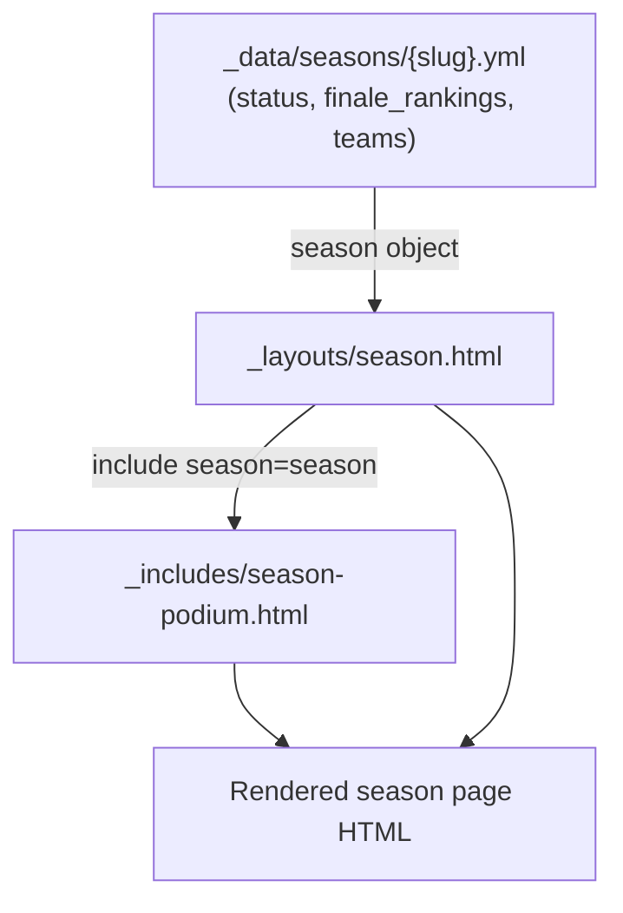

# Design Document: Season Podium

## Overview

The season podium feature adds a celebratory top-three display to completed season pages. When a season's YAML data includes `status: completed` and a `finale_rankings` list, the season layout renders a podium section at the very top of the page showing gold, silver, and bronze medalist teams with their logos and names.

The feature is entirely build-time: Liquid templates read the YAML data and emit static HTML. No JavaScript is required. The implementation follows the project's include-based architecture — a new partial `_includes/season-podium.html` receives the season data object as a parameter and renders the podium independently of the layout.

## Architecture

The feature touches three layers:

1. **Data** (`_data/seasons/{slug}.yml`) — two new optional fields: `status` and `finale_rankings`.
2. **Partial** (`_includes/season-podium.html`) — new Liquid partial that renders the podium given a `season` parameter.
3. **Layout** (`_layouts/season.html`) — conditionally includes the partial at the top and reorders existing sections.



The layout guards the include call with a Liquid condition:

```liquid

  

```

## Components and Interfaces

### `_includes/season-podium.html`

**Parameters:**
- `include.season` — the full season data object from `_data/seasons/{slug}.yml`

**Responsibilities:**
- Iterate over the first three entries of `include.season.finale_rankings`
- For each entry, resolve the team object from `include.season.teams` by matching slug
- Assign medal tier (gold / silver / bronze) based on loop index
- Render team logo (or placeholder) and team name
- Must not access `site.data` directly

**Medal tier mapping:**

| `forloop.index` | Medal  | CSS modifier class       |
|-----------------|--------|--------------------------|
| 1               | Gold   | `podium-entry--gold`     |
| 2               | Silver | `podium-entry--silver`   |
| 3               | Bronze | `podium-entry--bronze`   |

### `_layouts/season.html` changes

- Add podium include call at the top of `.season-detail`, guarded by the visibility condition
- Reorder existing sections to: podium → standings → schedule → teams

### `_data/seasons/{slug}.yml` schema additions

```yaml
status: completed          # optional; "completed" triggers podium visibility
finale_rankings:           # optional ordered list of team slugs
  - servers-of-the-court   # 1st place (gold)
  - pickle-posse           # 2nd place (silver)
  - long-shots             # 3rd place (bronze)
```

## Data Models

### Season YAML (extended)

```yaml
name: string
slug: string
start_date: date
end_date: date
status: string             # optional; "completed" = finished season
finale_rankings:           # optional; ordered list of team slugs (positions 1–3)
  - string                 # team slug — must match a slug in the teams list
teams:
  - slug: string
    name: string
    logo: string           # optional URL
    home_court: string
    roster: [...]
schedule: [...]
```

### Podium entry (resolved at render time in Liquid)

Each podium entry is not a stored object — it is resolved inline during template rendering:

```
slug   → looked up in season.teams → { name, logo }
index  → mapped to medal tier label and CSS class
```

## Correctness Properties

*A property is a characteristic or behavior that should hold true across all valid executions of a system — essentially, a formal statement about what the system should do. Properties serve as the bridge between human-readable specifications and machine-verifiable correctness guarantees.*

### Property 1: Finale rankings slugs are a subset of team slugs

*For any* season data object, every slug present in `finale_rankings` SHALL also appear as a `slug` in the `teams` list of the same season.

**Validates: Requirements 1.3**

### Property 2: Podium visibility matches the completed-with-rankings condition

*For any* season data object, the podium section SHALL be present in the rendered HTML if and only if `status == "completed"` AND `finale_rankings` is non-empty; in all other cases the podium section SHALL be absent.

**Validates: Requirements 2.1, 2.2, 2.3**

### Property 3: Rendered podium entry count equals the number of rankings (capped at 3)

*For any* season data object where the podium is visible, the number of podium entries rendered SHALL equal `min(finale_rankings.length, 3)`.

**Validates: Requirements 3.1, 4.1, 4.2, 4.3**

### Property 4: Medal labels are assigned by position

*For any* season data object where the podium is visible, the first entry SHALL carry the gold label, the second entry (if present) SHALL carry the silver label, and the third entry (if present) SHALL carry the bronze label.

**Validates: Requirements 3.2, 3.3, 3.4**

### Property 5: Team name is resolved from the teams list

*For any* season data object where the podium is visible, each rendered podium entry SHALL display the `name` of the team whose `slug` matches the corresponding `finale_rankings` entry.

**Validates: Requirements 3.5**

### Property 6: Logo or placeholder rendered based on team logo presence

*For any* season data object where the podium is visible, a podium entry for a team that has a `logo` value SHALL render an `` element with that logo's `src`; a podium entry for a team without a `logo` value SHALL render a placeholder element instead of an ``.

**Validates: Requirements 3.6, 3.7**

### Property 7: Podium section precedes all other sections in the rendered HTML

*For any* completed season page where the podium is rendered, the character offset of the podium section in the HTML SHALL be less than the character offset of the standings section, which SHALL be less than the schedule section, which SHALL be less than the teams section.

**Validates: Requirements 5.1, 5.2**

## Error Handling

Since this is a static site built at compile time, "errors" manifest as missing or malformed data rather than runtime exceptions. The design handles each gracefully:

| Condition | Behavior |
|---|---|
| `status` absent or not `"completed"` | Podium include is not called; no podium rendered |
| `finale_rankings` absent or empty | Podium include is not called; no podium rendered |
| A ranking slug has no matching team in `teams` | Team name falls back to the raw slug; no logo rendered (placeholder shown) |
| `finale_rankings` has more than 3 entries | Only the first 3 are used via `limit:3` in the Liquid loop |
| Team has no `logo` field | Placeholder `<div>` rendered instead of `` (mirrors `team-card.html` pattern) |

The slug-fallback behavior (showing the raw slug when no team match is found) is a defensive measure. In practice, Requirement 1.3 mandates that all ranking slugs match a team, so this path should never be reached in valid data.

## Testing Strategy

This feature is a Liquid template rendering feature. The rendering logic is pure: given a season data object, the output HTML is fully determined. This makes it well-suited for property-based testing using JavaScript functions that simulate the Liquid rendering logic, following the same pattern used in `tests/rendering.test.js`.

**Testing library:** `fast-check` (already in use in the project)

**Dual approach:**

- **Property tests** — simulate the Liquid rendering logic in JS and verify universal properties across generated season data objects (100 iterations each)
- **Smoke/example tests** — verify the built `_site/seasons/spring-2026.html` once `spring-2026.yml` is updated with `status: completed` and `finale_rankings`

**Property test tag format:** `Feature: season-podium, Property {N}: {property_text}`

### Property tests (in `tests/rendering.test.js`)

Each property test simulates the relevant Liquid logic as a JS function and runs `fc.assert` with `{ numRuns: 100 }`.

| Property | What the JS simulation covers |
|---|---|
| P1: Rankings slugs ⊆ team slugs | `validateRankingSlugs(season)` — checks every ranking slug exists in teams |
| P2: Podium visibility condition | `shouldShowPodium(season)` — mirrors the `if` guard in `season.html` |
| P3: Entry count = min(rankings, 3) | `renderPodium(season)` — counts `.podium-entry` elements in output |
| P4: Medal labels by position | `renderPodium(season)` — checks gold/silver/bronze class on each entry |
| P5: Team name resolved | `renderPodium(season)` — verifies team name appears in each entry |
| P6: Logo or placeholder | `renderPodium(season)` — checks `` vs placeholder per team logo presence |
| P7: Section order | `renderSeasonPage(season)` — compares string offsets of section markers |

### Example / smoke tests

- `_site/seasons/spring-2026.html` contains `.season-podium` when `spring-2026.yml` has `status: completed` and `finale_rankings`
- `_includes/season-podium.html` source does not contain `site.data`
- `_layouts/season.html` source contains `include season-podium.html season=season`
