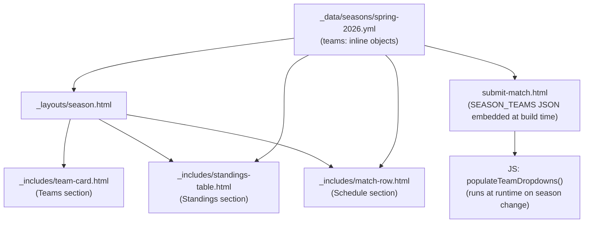

# Design Document: season-teams-view

## Overview

This feature migrates team data from global files (`_data/teams.yml`, `_data/data.yml`) into per-season YAML files, adds a Teams section to the season page layout, and removes the now-redundant global `/teams/` page and nav link.

The core insight is that teams are season-specific — they are drafted fresh each season — so the data model should reflect that. After this change, `_data/seasons/spring-2026.yml` owns the full team objects for that season, and the season layout renders them directly without consulting any global teams file.

## Architecture

The change touches five layers:

1. **Data** — `_data/seasons/spring-2026.yml` gains inline team objects; `_data/teams.yml` and the `teams` key in `_data/data.yml` are removed.
2. **Layout** — `_layouts/season.html` is updated to render a Teams section (above standings) using the inline `season.teams` list.
3. **Includes** — `_includes/standings-table.html` and `_includes/match-row.html` are updated to resolve team names from `season.teams` instead of `site.data.teams`.
4. **Navigation & pages** — `teams.html` is deleted; the Teams nav link is removed from `_includes/header.html`.
5. **Submit match form** — `submit-match.html` embeds all season team data as a JSON constant at build time (via Liquid) and uses JavaScript to repopulate the Home/Away team dropdowns when the season select changes.



## Components and Interfaces

### `_data/seasons/{slug}.yml` — Season Data File

Gains a `teams` key containing a list of fully-inlined team objects. Schedule entries continue to use slug strings for `home_team` / `away_team`.

```yaml
teams:
  - slug: servers-of-the-court
    name: Servers of the Court
    home_court: Pickleball Hideout
    roster:
      - name: Amy Tucker
        role: captain
      - name: Nathan Cross
        role: member
schedule:
  - week: 1
    home_team: servers-of-the-court   # slug reference — resolved at render time
    away_team: pickle-posse
```

### `_layouts/season.html` — Season Page Layout

The existing `season-teams` section currently iterates `season.teams` as a list of slug strings and looks up names from `site.data.teams`. It is replaced with a section that iterates the inline team objects and renders each via `team-card.html`.

```liquid
<section class="season-teams">
  <h2>Teams</h2>
  
    <div class="teams-grid">
      
        
      
    </div>
  
    <p>No teams have been announced yet.</p>
  
</section>
```

The Teams section appears before the Standings section in the template.

### `_includes/standings-table.html` — Standings Table

Currently resolves team names via ``. After this change, `season.teams` is a list of objects, so the standings table iterates `season.teams` directly (using `team.slug` as the identifier) rather than iterating slug strings and looking up a global list.

The sort key logic and win/loss computation remain unchanged; only the team identity field changes from a bare slug string to `team.slug`.

### `_includes/match-row.html` — Match Row

Currently resolves team names via ``. The include signature changes: instead of receiving `teams=site.data.teams`, it receives `teams=season.teams`, and the lookup key changes from `t.id` to `t.slug`.

In `_layouts/season.html`:
```liquid

```

### `_includes/team-card.html` — Team Card Partial

No changes needed. It already accepts a `team` object with `name`, `home_court`, and `roster` fields.

### `_includes/header.html` — Navigation

The Teams nav link is removed:
```html
<!-- REMOVE this line -->
<a class="nav-link active" href="/teams">Teams</a>
```

### `teams.html` — Global Teams Page

Deleted entirely.

### `submit-match.html` — Season-Aware Team Dropdowns

Because Jekyll is a static site generator, Liquid cannot filter teams by the runtime-selected season. Instead, all season team data is embedded as a JSON object at build time, and JavaScript repopulates the dropdowns when the season select changes.

**Build-time data embedding (Liquid)**

A `<script>` block in `submit-match.html` serialises every season's team list into a single JS constant:

```liquid
<script>
const SEASON_TEAMS = {
  
  
  "{{ s.data_file }}": [
    
    { "slug": "{{ team.slug }}", "name": "{{ team.name }}" },
    
  ],
  
};
</script>
```

`s.data_file` is the key used by the season select (`<option value="{{ s.data_file }}">`), so it doubles as the lookup key into `SEASON_TEAMS`.

**Runtime dropdown population (JavaScript)**

On `DOMContentLoaded`, both team dropdowns are initialised as disabled with only the placeholder option. A `change` listener on `#season-select` calls `populateTeamDropdowns`:

```js
function populateTeamDropdowns(seasonKey) {
  const teams = SEASON_TEAMS[seasonKey] || [];
  [document.getElementById('home-team'), document.getElementById('away-team')].forEach(sel => {
    sel.innerHTML = '<option value="">— select —</option>';
    teams.forEach(t => {
      const opt = document.createElement('option');
      opt.value = t.slug;
      opt.textContent = t.name;
      sel.appendChild(opt);
    });
    sel.disabled = teams.length === 0;
  });
}

document.getElementById('season-select').addEventListener('change', function () {
  populateTeamDropdowns(this.value);
});
```

**Initial / empty state**

On page load (before any season is chosen) both dropdowns are rendered with `disabled` and a single `— select —` placeholder. The static `` Liquid loops in the current template are removed entirely.

**Interaction with form validation**

`validateForm` already treats an empty string value as a missing field, so a disabled dropdown with no selection will naturally fail validation and surface the existing field-error UI.

## Data Models

### Inline Team Object (in Season Data File)

| Field | Type | Required | Description |
|---|---|---|---|
| `slug` | string | yes | Unique identifier, matches schedule slug references |
| `name` | string | yes | Display name |
| `home_court` | string | no | Court name |
| `roster` | list | no | List of `{name, role}` objects |

### Roster Member

| Field | Type | Description |
|---|---|---|
| `name` | string | Player display name |
| `role` | string | `captain` or `member` |

### Migration mapping

| Old location | New location |
|---|---|
| `_data/teams.yml[].id` | `_data/seasons/{slug}.yml teams[].slug` |
| `_data/teams.yml[].name` | `_data/seasons/{slug}.yml teams[].name` |
| `_data/teams.yml[].home_court` | `_data/seasons/{slug}.yml teams[].home_court` |
| `_data/teams.yml[].roster` | `_data/seasons/{slug}.yml teams[].roster` |

## Correctness Properties

*A property is a characteristic or behavior that should hold true across all valid executions of a system — essentially, a formal statement about what the system should do. Properties serve as the bridge between human-readable specifications and machine-verifiable correctness guarantees.*

### Property 1: Team objects contain all required fields

*For any* team object in a season's `teams` list, that object SHALL have non-empty `slug`, `name`, `home_court`, and `roster` fields.

**Validates: Requirements 1.1**

### Property 2: Teams section renders all teams

*For any* season data object whose `teams` list has N entries, the rendered season page HTML SHALL contain exactly N team card elements.

**Validates: Requirements 2.1**

### Property 3: Team card renders complete team data

*For any* team object, the HTML rendered by `team-card.html` SHALL contain the team's `name`, `home_court`, and each roster member's `name`.

**Validates: Requirements 2.3**

### Property 4: Schedule slug resolution

*For any* schedule entry whose `home_team` or `away_team` slug matches a team in `season.teams`, the rendered match row SHALL display that team's `name` rather than the raw slug string.

**Validates: Requirements 4.3**

### Property 5: Season-select populates correct team options

*For any* map of seasons to team lists and any selected season key, calling `populateTeamDropdowns` SHALL result in both the Home Team and Away Team dropdowns containing exactly the options (slug values and display names) for that season, and no options from any other season.

**Validates: Requirements 5.1, 5.3**

## Error Handling

- **Empty teams list** — the season layout renders a "No teams have been announced yet." message (Requirement 2.4). No error is thrown.
- **Unresolvable slug in schedule** — if a schedule entry references a slug not present in `season.teams`, Liquid's `assign` fallback leaves the variable as the raw slug string. The match row will display the slug rather than a name. This is acceptable degraded behavior; no build error occurs.
- **Missing optional fields** — `team-card.html` already guards `home_court` with `` and `roster` with a size check, so partial team objects render gracefully.
- **Season with no teams in SEASON_TEAMS** — `populateTeamDropdowns` falls back to an empty array, leaving both dropdowns disabled with only the placeholder. Form validation will catch the missing selection before submission.

## Testing Strategy

This feature is primarily a data migration and Liquid template change. The logic under test is:

- Liquid template rendering (slug → name resolution, conditional sections, ordering)
- YAML data shape validation

PBT applies to the rendering logic (Properties 1–4 above). The test suite uses **vitest** (already present in the repo) with a lightweight Liquid renderer or by asserting on the YAML data directly.

### Unit / Example Tests

- Render season page with empty `teams` list → assert "no teams" message present
- Render season page with teams → assert Teams section appears before Standings section in HTML
- Assert `_data/teams.yml` does not exist after migration (smoke)
- Assert `_data/data.yml` does not contain a `teams` key after migration (smoke)
- Assert `teams.html` does not exist after migration (smoke)
- Assert `_includes/header.html` does not contain `/teams/` link after change (smoke)
- Build `_site/` and assert no `_site/teams/index.html` is generated (integration)
- On page load with no season selected, both team dropdowns are disabled and contain only the placeholder option (Requirement 5.2)

### Property-Based Tests

Use **fast-check** (available via npm) for property generation. Each test runs a minimum of 100 iterations.

**Property 1 — Team objects contain all required fields**
Tag: `Feature: season-teams-view, Property 1: team objects contain all required fields`
Generate: random team objects with varying slugs, names, courts, and rosters
Assert: each object has `slug`, `name`, `home_court`, `roster` all present and non-empty

**Property 2 — Teams section renders all teams**
Tag: `Feature: season-teams-view, Property 2: teams section renders all teams`
Generate: season data objects with 0–10 randomly generated team entries
Assert: rendered HTML contains the same number of `.team-card` elements as `teams.length`

**Property 3 — Team card renders complete team data**
Tag: `Feature: season-teams-view, Property 3: team card renders complete team data`
Generate: random team objects (varying names, courts, roster sizes)
Assert: rendered card HTML contains team name, home court, and all roster member names

**Property 4 — Schedule slug resolution**
Tag: `Feature: season-teams-view, Property 4: schedule slug resolution`
Generate: season data with random teams and schedule entries whose slugs are drawn from the teams list
Assert: rendered match rows contain team names, not raw slugs

**Property 5 — Season-select populates correct team options**
Tag: `Feature: season-teams-view, Property 5: season-select populates correct team options`
Generate: random `SEASON_TEAMS` maps (2–5 seasons, each with 2–8 teams with distinct slugs/names); randomly pick one season key
Assert: after calling `populateTeamDropdowns(seasonKey)`, both `#home-team` and `#away-team` contain exactly the options for that season (correct slugs and names), and no options from other seasons appear
