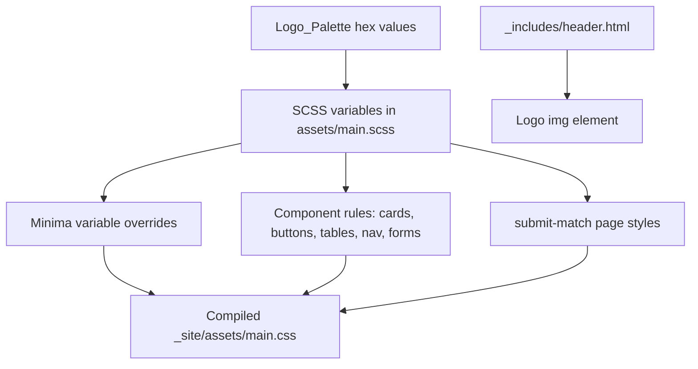

# Design Document: UI Color Theme Update

## Overview

This feature updates the Junebug Pickleball League site's color theme to align with the brand colors in the main logo (`assets/images/JuneBug_Logo_main.png`). The work is purely presentational — no data models, business logic, or JavaScript behavior changes. The implementation touches three areas:

1. SCSS variable declarations in `assets/main.scss` (and its duplicate `assets/css/style.scss`)
2. Inline `<style>` blocks in `pages/submit-match.html` replaced with SCSS variables
3. The `_includes/header.html` template (logo image replacing text title)

The site uses Jekyll with the Minima theme. Styles flow through two SCSS entry points that are currently identical in content; both must be updated. Minima's own variables are overridden before `@import "minima"`, so the new palette values will cascade into Minima's base styles automatically.

## Architecture

```
assets/main.scss          ← primary SCSS entry point (used by Jekyll build)
assets/css/style.scss     ← secondary entry point (identical content, kept in sync)
  └─ @import "minima"     ← Minima base styles, overridden by variables above it
_includes/header.html     ← header template, logo img replaces text title
pages/submit-match.html   ← inline <style> block replaced with SCSS variable references
```

The palette is defined once as SCSS variables at the top of `assets/main.scss`. All component rules in the same file reference those variables. The `submit-match.html` page's inline styles are moved into the shared SCSS stylesheet so they can reference the same variables directly — eliminating hardcoded hex values from the page file entirely.



## Components and Interfaces

### 1. SCSS Design Tokens (`assets/main.scss`, `assets/css/style.scss`)

Both files are updated identically. The variable block at the top is replaced with the new Logo_Palette values. All component rules below already reference these variables — no rule-level changes are needed beyond the variable values themselves, except renaming `$border` → `$border-color` to match the requirements naming.

New variable block (replaces existing):

```scss
// ─── Minima overrides (must precede @import "minima") ────────────────────────
$background-color: #1E2A3A;
$brand-color:      #C8E64B;
$text-color:       #FFFFFF;
$grey-color:       #A0AAB4;
$grey-color-dark:  #4D5F72;
$grey-color-light: #2C3E50;

@import "minima";

// ─── Design tokens ───────────────────────────────────────────────────────────
$bg-primary:    #1E2A3A;
$bg-secondary:  #2C3E50;
$bg-tertiary:   #34495E;
$accent:        #C8E64B;
$accent-hover:  #A7C93F;
$text-primary:  #FFFFFF;
$text-secondary:#A0AAB4;
$border-color:  #4D5F72;
$success:       #2ECC71;
$danger:        #E74C3C;
```

All existing component rules that reference `$border` must be updated to `$border-color` to match the renamed variable.

### 2. Submit Match Page Styles (`pages/submit-match.html` → `assets/main.scss`)

The inline `<style>` block is removed from `pages/submit-match.html` entirely. Its rules are moved into `assets/main.scss` (and `assets/css/style.scss`) under a clearly marked section, with all hardcoded hex values replaced by the corresponding Design_Token variables:

| Old inline hex | New SCSS variable  |
|----------------|--------------------|
| `#0f0f1a`      | `$bg-primary`      |
| `#1a1a2e`      | `$bg-secondary`    |
| `#16213e`      | `$bg-tertiary`     |
| `#e94560`      | `$accent`          |
| `#c73652`      | `$accent-hover`    |
| `#e8e8f0`      | `$text-primary`    |
| `#a0a0b8`      | `$text-secondary`  |
| `#2a2a4a`      | `$border-color`    |
| `#4caf50`      | `$success`         |
| `#f44336`      | `$danger`          |

All layout, spacing, typography, and non-color rules are preserved unchanged.

### 3. Header Logo (`_includes/header.html`)

The `.site-title` anchor currently renders `{{ site.title }}` as text. It is updated to render the logo image instead, with the text title as `alt` text for accessibility and as an `onerror` fallback:

```html
<a class="site-title" href="/">
  
</a>
```

A `.site-logo` CSS rule is added to the stylesheet to constrain the height:

```scss
.site-logo {
  max-height: 48px;
  width: auto;
  display: block;
}
```

The existing `.site-title` text color rules remain in place — they apply to the anchor wrapper and will style the fallback text if the image fails to load.

## Data Models

No data model changes. This feature is purely presentational. The Logo_Palette is a static set of hex values; there is no runtime data involved.

**Logo_Palette (reference)**

| Token            | Hex value  | Usage                          |
|------------------|------------|--------------------------------|
| `$bg-primary`    | `#1E2A3A`  | Main page background           |
| `$bg-secondary`  | `#2C3E50`  | Card/panel backgrounds         |
| `$bg-tertiary`   | `#34495E`  | Inputs, table rows, section bg |
| `$text-primary`  | `#FFFFFF`  | Main body text                 |
| `$text-secondary`| `#A0AAB4`  | Muted/secondary text           |
| `$accent`        | `#C8E64B`  | Primary brand color            |
| `$accent-hover`  | `#A7C93F`  | Hover state for accent elements|
| `$border-color`  | `#4D5F72`  | Borders and dividers           |
| `$success`       | `#2ECC71`  | Success states                 |
| `$danger`        | `#E74C3C`  | Error/destructive states       |

## Error Handling

**Logo image load failure**: The `onerror` handler on the `` element hides the broken image and injects the site title text as a text node, preserving the link's usability. The `alt` attribute also provides a text fallback for screen readers regardless of load state.

**SCSS compilation errors**: If a variable reference is broken (e.g. `$border` referenced after renaming to `$border-color`), Jekyll's SCSS compilation will fail with a clear error. The fix is to ensure all `$border` references in the component rules are updated to `$border-color`.

## Testing Strategy

This feature involves CSS/SCSS variable replacement and HTML template changes. It is not suitable for property-based testing — there is no logic with meaningful input variation, no parsers or data transformations, and no universal properties to quantify.

**PBT assessment**: Not applicable. The feature is UI rendering and configuration — the palette is a fixed set of values, and the changes are declarative substitutions.

### Static Analysis (SMOKE)

- `assets/main.scss` declares all 10 Design_Token variables before `@import "minima"`
- No bare hex color literals appear in rule bodies (only in variable declarations at the top)
- Minima variable overrides appear before `@import "minima"`
- `pages/submit-match.html` contains no `<style>` block and no hardcoded hex values
- Submit match styles exist in `assets/main.scss` using Design_Token variables

### Example-Based Unit Tests

- WCAG contrast ratio ≥ 4.5:1 for each text/background pairing:
  - `$text-primary` (#FFFFFF) on `$bg-primary` (#1E2A3A)
  - `$text-primary` (#FFFFFF) on `$bg-secondary` (#2C3E50)
  - `$text-primary` (#FFFFFF) on `$bg-tertiary` (#34495E)
  - `$text-secondary` (#A0AAB4) on `$bg-primary` (#1E2A3A)
  - `$accent` (#C8E64B) on `$bg-primary` (#1E2A3A)
- Header template renders an `` with `src` pointing to `JuneBug_Logo_main.png`
- Header template does not render the plain text site title as a text node outside an ``
- Logo `` has a non-empty `alt` attribute equal to `site.title`
- Logo `` has `max-height: 48px` applied via `.site-logo` class

### Manual Verification

- Visual review of each page after `bundle exec jekyll serve` to confirm consistent palette application
- Verify logo renders correctly in the sticky header at desktop and mobile breakpoints
- Confirm submit-match form styles are visually identical after moving styles to the shared stylesheet
